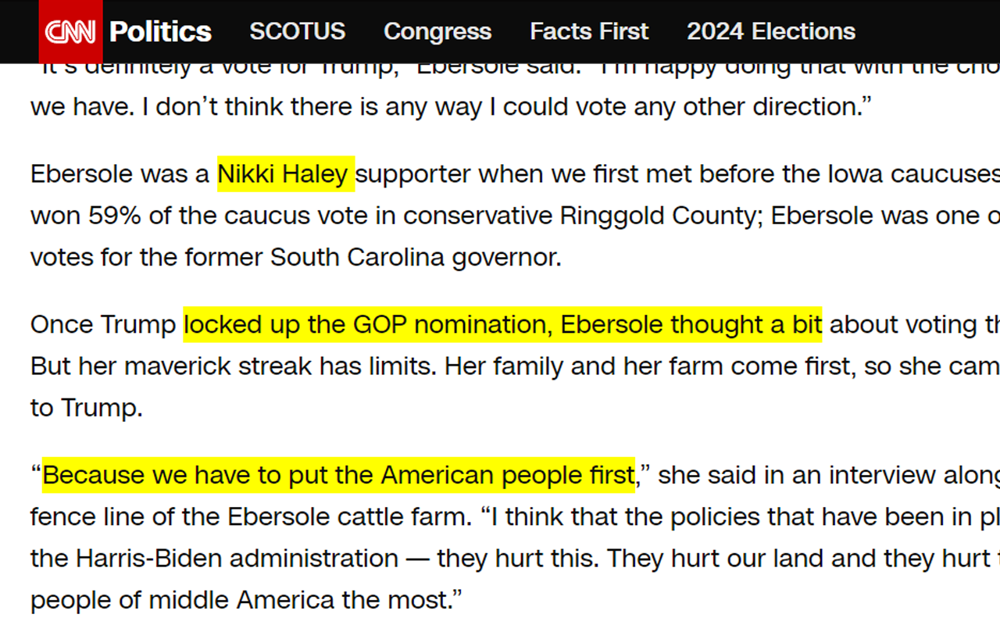
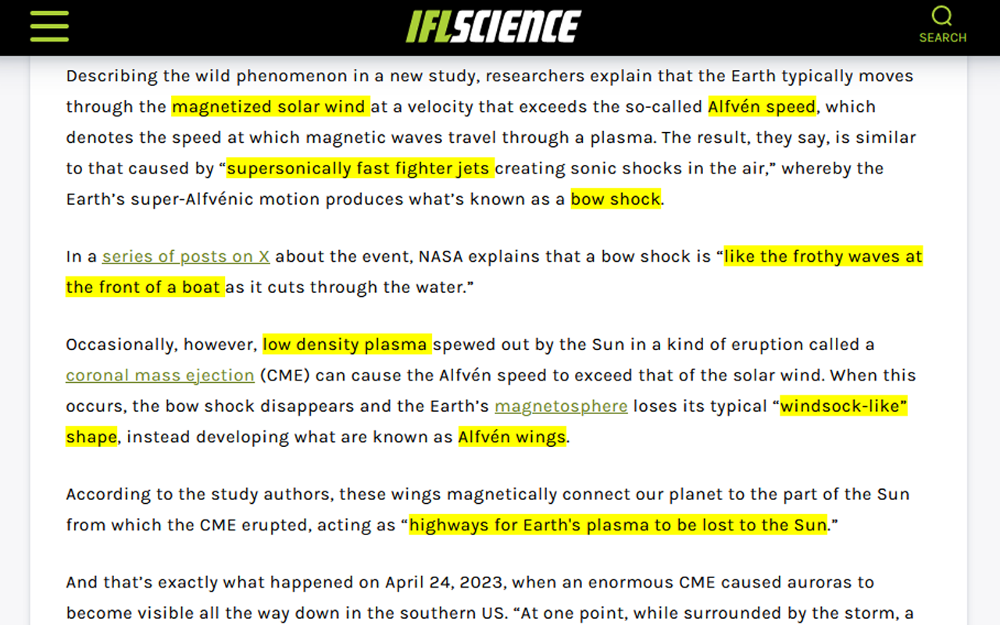

# Click2Highlight

Click2Highlight is a simple browser extension that lets you toggle highlights on double-clicked words for easy reference while reading. It's perfect for research, fact-checking, or just highlighting important points. 

## Features

- Double-click any word or phrase to toggle a yellow highlight.
- Quickly remove highlights with a second double-click.
- All highlights are temporary and will reset upon page refresh.
  
## Use Cases

- Doing research on a company or topic? Highlight important points for easy reference.
- Reading an article with questionable or spurious claims? Use highlights to keep track of what needs fact-checking.
- Highlights do not persist across refreshes, making it ideal for temporary in-session reference.

## How It Works

Click2Highlight adds inline styling to the web page as you view it. The highlights are not saved permanently, meaning refreshing the page will wipe any existing highlights. This allows for a quick, non-permanent way to mark important content.

## Installation

- Manually upload to either Chrome or Firefox by renaming the manifest file to 'manifest.json'
- Chrome web store
- Firefox web store

## Demo Images 

